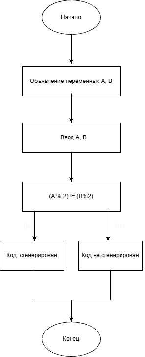

# Домашнее задание к работе 4

## Условие задачи

Написать и отладить программу для контроллера двери секретной лаборатории, которая проверяет два кода, сгенерированных случайным образом, и определяет, можно ли предоставить доступ. Доступ открывается, если выполнено хотя бы одно из условий: ровно один из кодов является чётным.

## 1. Алгоритм и блок-схема
### Алгоритм
```
Начало.
Ввести исходные данные: code1 — первый код доступа, code2 — второй код доступа.
Проверить условие стандартного режима: ровно один из кодов чётный.
Проверить условие повышенного приоритета: оба кода кратны трём.
Если выполнено хотя бы одно из условий — доступ разрешён.
Вывести результат.
Конец.
```
### Блок-схема

## 2. Реализация программы
```
#define _CRT_SECURE_NO_WARNINGS
#include <stdio.h>
#include <locale.h>

int main() 
{
    setlocale(LC_ALL, "RUS");
    int A, B;
    printf("Введите сумму A: ");
    scanf("%d", &A);
    printf("Введите сумму B: ");
    scanf("%d", &B);
    if ((A % 2) != (B % 2)) 
    {
        printf("Код сгенерирован\n");
    }
    else 
    {
        printf("Код не сгенерирован\n");
    }
    getchar();
}
```
### 3. Результаты работы программы
```
Введите сумму A: 4
Введите сумму B: 7

--- Результаты ---
Сумма A:                    4
Сумма B:                    7
Код сгенерирован

Введите сумму A: 10
Введите сумму B: 10
```
```
--- Результаты ---
Сумма A:                    10
Сумма B:                    10
Код не сгенерирован
```
### 4. Информация о разработчике

Дегтярева Полина, бИЦТ-262
